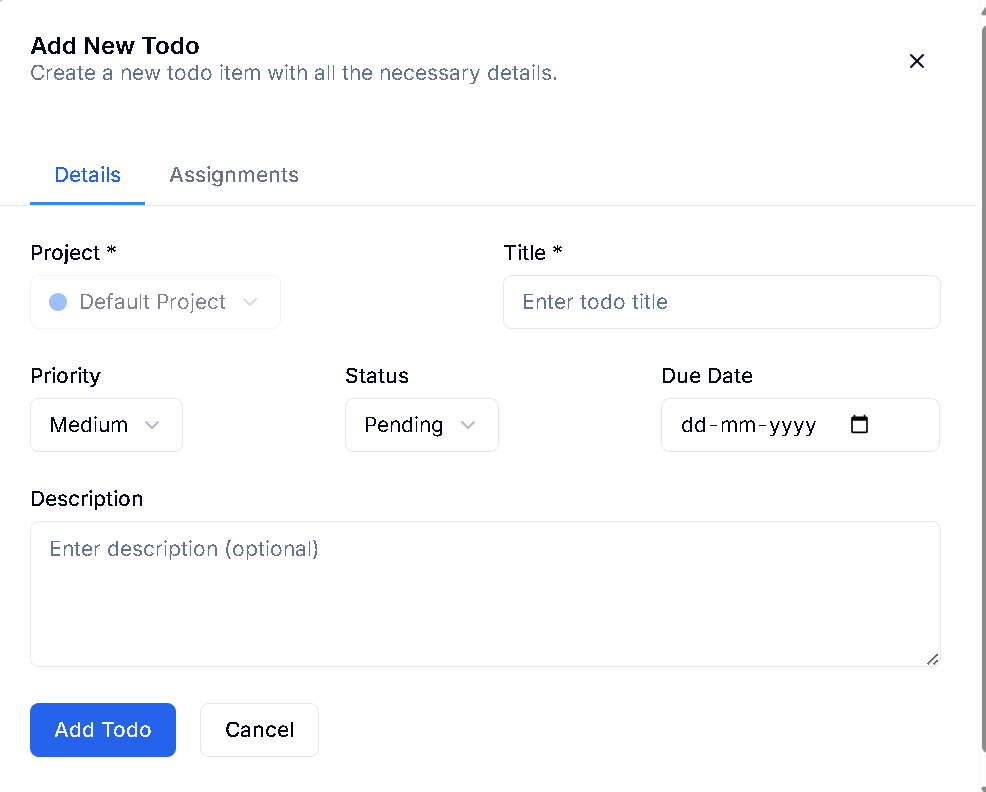
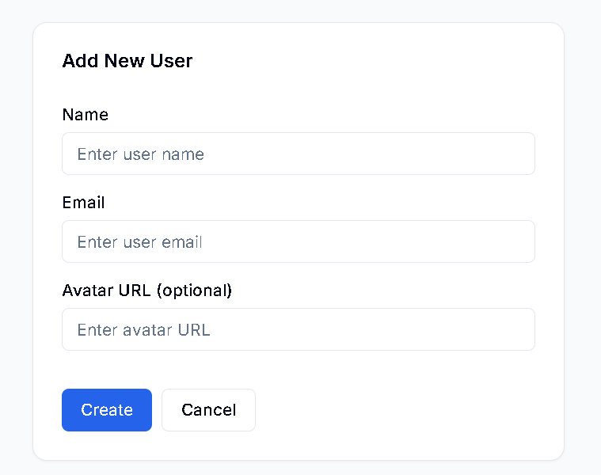
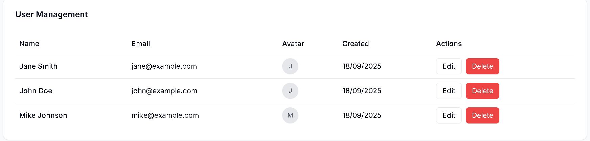
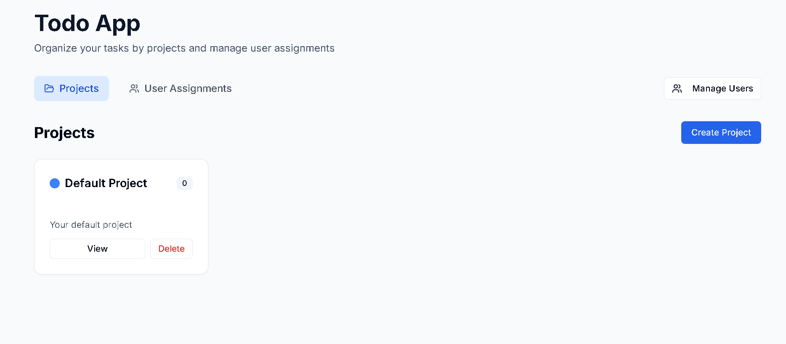

# Todo Management App






A modern, modular todo management application built with Next.js, TypeScript, and shadcn/ui components.

## Features

- ✨ **Modern UI**: Built with shadcn/ui components for a consistent and beautiful interface
- 🧩 **Modular Architecture**: Clean separation of concerns with reusable components
- 📱 **Responsive Design**: Works seamlessly across all device sizes
- 🎨 **Consistent Branding**: Blue gradient theme with professional styling
- ⚡ **Real-time Updates**: Instant feedback for all CRUD operations
- 🏷️ **Smart Badges**: Priority and status indicators with color coding
- 📊 **Sorting Options**: Sort by priority, due date, or creation date
- 🔄 **Loading States**: Smooth loading and error handling

## Tech Stack

- **Framework**: Next.js 14 with App Router
- **Language**: TypeScript
- **Styling**: Tailwind CSS with shadcn/ui
- **Database**: Supabase
- **UI Components**: Radix UI primitives with custom styling
- **Icons**: Lucide React

## Project Structure

```
todo/
├── app/
│   ├── globals.css          # Global styles with shadcn/ui tokens
│   ├── layout.tsx           # Root layout
│   └── page.tsx             # Main page (refactored to use modular components)
├── components/
│   ├── ui/                  # shadcn/ui base components
│   │   ├── button.tsx       # Button component with variants
│   │   ├── input.tsx        # Input component
│   │   ├── textarea.tsx     # Textarea component
│   │   ├── select.tsx       # Select component
│   │   ├── card.tsx         # Card component
│   │   ├── badge.tsx        # Badge component with priority/status variants
│   │   ├── loading-spinner.tsx  # Loading spinner component
│   │   └── error-display.tsx    # Error display component
│   └── todo/                # Todo-specific components
│       ├── TodoForm.tsx     # Form for adding/editing todos
│       ├── TodoItem.tsx     # Individual todo item display
│       └── TodoList.tsx     # Main todo list container
├── lib/
│   ├── supabaseClient.ts    # Supabase client configuration
│   ├── todoService.ts       # Todo service functions
│   ├── types.ts             # TypeScript type definitions
│   └── utils.ts             # Utility functions (clsx, tailwind-merge)
├── Dockerfile             # Docker configuration file
└── supabase/
    └── schema.sql           # Database schema
```

## Component Architecture

### UI Components (`components/ui/`)
- **Button**: Multiple variants including gradient, outline, ghost
- **Input**: Consistent form inputs with focus states
- **Textarea**: Multi-line text input
- **Select**: Dropdown selection with Radix UI
- **Card**: Container component for content sections
- **Badge**: Status and priority indicators with color coding
- **LoadingSpinner**: Consistent loading states
- **ErrorDisplay**: Error handling with retry functionality

### Todo Components (`components/todo/`)
- **TodoForm**: Reusable form for adding/editing todos
- **TodoItem**: Individual todo display with inline editing
- **TodoList**: Main container managing todo list state

## Key Features

### Consistent Branding
- Blue gradient theme throughout the application
- Professional color palette with proper contrast
- Smooth animations and transitions
- Responsive design patterns

### Modular Design
- Each component is self-contained with clear interfaces
- Props-based communication between components
- Reusable components across the application
- Easy to test and maintain

### Enhanced UX
- Inline editing for todos
- Real-time status updates
- Smart priority and due date indicators
- Smooth loading and error states
- Confirmation dialogs for destructive actions

## Getting Started

1. **Install dependencies**:
   ```bash
   npm install
   ```

2. **Set up environment variables**:
   Create a `.env.local` file with your Supabase credentials:
   ```
   NEXT_PUBLIC_SUPABASE_URL=your_supabase_url
   NEXT_PUBLIC_SUPABASE_ANON_KEY=your_supabase_anon_key
   ```

3. **Set up the database**:
   ```bash
   npm run setup-db
   ```

4. **Run the development server**:
   ```bash
   npm run dev
   ```

5. **Open your browser**:
   Navigate to `http://localhost:3000`

## Development

### Adding New Components
1. Create the component in the appropriate directory (`ui/` for base components, `todo/` for todo-specific)
2. Follow the shadcn/ui patterns for consistency
3. Use the `cn()` utility for class merging
4. Add proper TypeScript interfaces

### Styling Guidelines
- Use Tailwind CSS classes for styling
- Leverage shadcn/ui design tokens
- Maintain consistent spacing and typography
- Follow the blue gradient theme for branding

### State Management
- Use React hooks for local state
- Keep state as close to where it's used as possible
- Pass data through props for component communication
- Use callbacks for parent-child communication

## Contributing

1. Follow the existing code structure and patterns
2. Use TypeScript for all new code
3. Maintain consistent styling with the design system
4. Test components thoroughly before submitting

## License

MIT License - feel free to use this project for your own applications!
